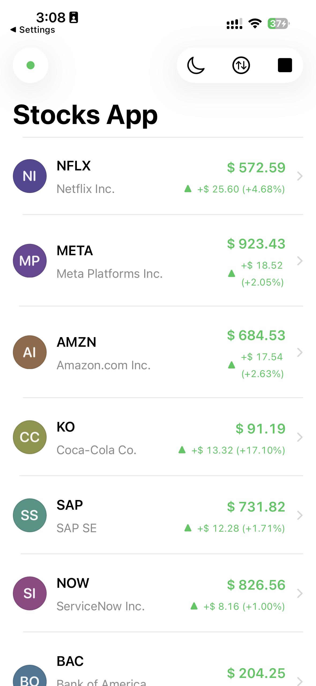
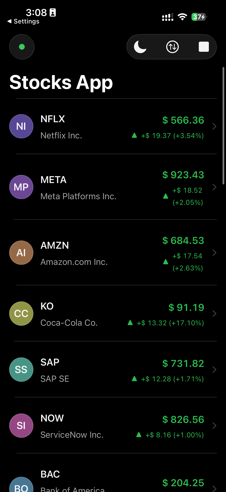
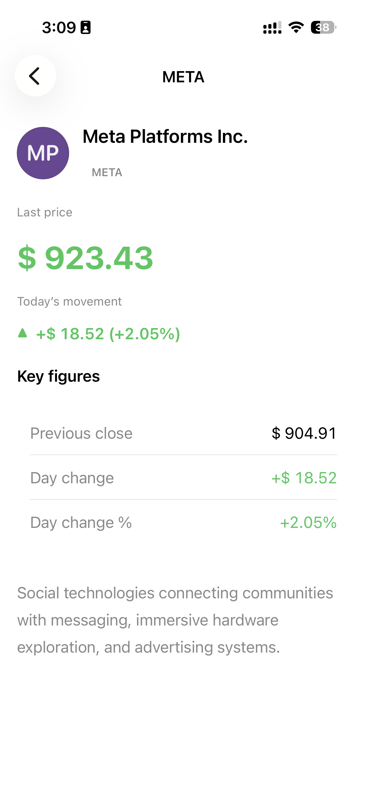
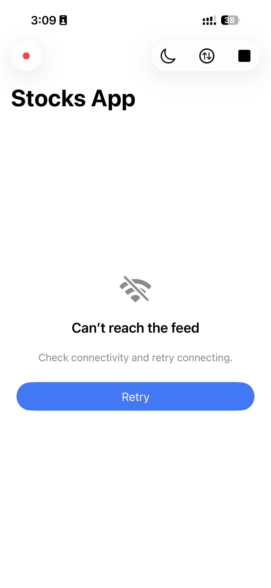
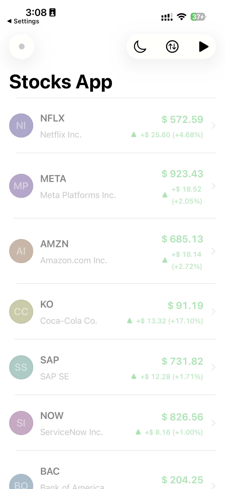

# StockTracker

<div align="center">


An iOS app for streaming equities-style quotes over WebSocket with local persistence and a modular Swift Package layout.

[Features](#-about) • [Architecture](#️-architecture) • [Getting Started](#-getting-started) • [Testing](#-testing) • [CI](#-ci) • [Future Improvements](#-future-improvements)

</div>

---

## 📱 About

StockTracker connects to an Echo-compatible WebSocket feed that periodically publishes JSON payloads keyed by ticker symbol. Symbols and company blurbs ship in the bundled catalog resource; live updates merge into the UI and flush to Swift Data when appropriate. Browse a sortable roster, drill into detail, toggle light or dark presentation, start or stop streaming, and recover gracefully when connectivity returns using Network reachability to resume the feed.

Default transport falls through to wss://ws.postman-echo.com/raw if Info keys are absent, which is convenient for local runs without wiring a bespoke server.

### Key Features

- Catalog-backed symbol list (bundled JSON: symbol, display name, description)
- WebSocket-driven quote stream with configurable endpoint via xcconfig into Info.plist
- Persisted snapshots and a paging API for reading stored quotes
- Connection state surfaced in the UI across idle, connecting, connected, and failure paths
- Scene-aware feed lifecycle (active versus inactive coordination on the repository)
- Presentation layer with navigation and a shared palette environment
- Reachability-triggered transport resume via the feed lifecycle service

---

## 🎬 Screenshots

<div align="center">







</div>

### Demo Video
https://github.com/user-attachments/assets/8fa15f03-ac18-49b5-80eb-ce58f799a7d1


---

## 🏗️ Architecture

The codebase uses a layered layout centered on StockTrackerDomain (pure models and StockRepositoryProtocol) implemented by the app target’s DefaultStockRepository. StockSocketKit isolates the WebSocket handshake, backoff, outbound pulse cadence, and JSON mapping into StockQuote payloads.

SwiftUI observes Observable screen models (StocksScreenModel, StockDetailViewModel) fed by AsyncStream fan-out for quotes and feed connection transitions.

### Layer Structure

```
┌─────────────────────────────────────────────┐
│           Presentation Layer                 │
│  SwiftUI Views + @Observable ViewModels       │
│  StocksListView, StockDetailView, Root…       │
└────────────────────┬──────────────────────────┘
                     │
┌────────────────────▼──────────────────────────┐
│           Application composition            │
│  ApplicationBootstrap, FeedTransportConfig    │
│  StockFeedLifecycleService (reachability)     │
└────────────────────┬──────────────────────────┘
                     │
┌────────────────────▼──────────────────────────┐
│  Domain (Swift Package — StockTrackerDomain)  │
│  StockQuote, StockCatalogEntry                │
│  StockRepositoryProtocol, FeedConnectionState   │
└────────────────────┬──────────────────────────┘
                     │
        ┌────────────┴────────────┐
        │                         │
┌───────▼────────┐     ┌──────────▼───────────────┐
│  Data Layer    │     │ Networking / Transport    │
│  DefaultStock  │     │ StockSocketKit SPM         │
│  Repository    │────▶│ EchoWebSocketSession,     │
│  Swift Data    │     │ Exponential backoff, TLS  │
│  Catalog JSON  │     │ StockEchoFeed protocol    │
└────────────────┘     └─────────────────────────┘
```

### Data Flow (simplified)

1. Bootstrap validates socket URL wiring, loads the catalog resource, constructs the Swift Data stack and DefaultStockRepository with an EchoWebSocketSession factory.
2. The UI activates StocksScreenModel and may start streaming from the repository.
3. The repository consumes the echo feed event stream, maps events to StockQuote, publishes over streams and merged state, and persists batches through the persistence helpers.
4. Lifecycle observes scene phase and path updates to remount transport after outages.

---

## 🛠️ Tech Stack

| Area | Choices |
|------|---------|
| UI | SwiftUI, NavigationStack, Observation |
| Persistence | Swift Data with a PersistedQuote schema |
| Concurrency | async and await, actors in the socket package, MainActor repository |
| Networking | URLSessionWebSocketTask with a custom handshake coordinator |
| Modularization | Local Swift packages StockTrackerDomain and StockSocketKit |
| Quality | SwiftLint in strict CI, XCTest per module plus an app UITest target |

Development notes:

- Swift Package manifests use Swift 6 and declare iOS 18 and macOS 15 as package platforms.
- The Xcode app target’s deployment version is defined in the project settings; align it with the Xcode and SDK you use locally when they differ from package minimums.

---

## 📁 Project Structure

```
StockTracker/
├── StockTracker/
│   ├── StockTrackerApp.swift
│   ├── Composition/              # Bootstrap + feed endpoint wiring
│   ├── Config/                  # xcconfig: FEED_WEBSOCKET_* into Info.plist
│   ├── Data/
│   │   ├── Repository/           # DefaultStockRepository, mapping helpers
│   │   ├── Persistence/          # Persisted quote models + accessors
│   │   ├── Catalog/              # Catalog JSON decoding
│   │   ├── EventBroadcast/       # Broadcast fan-out
│   │   └── Formatting/           # Numeric encoding helpers
│   ├── Presentation/
│   │   ├── Views/
│   │   ├── ViewModels/
│   │   └── Support/              # Palettes, navigation routes, localization keys
│   ├── UseCases/                 # Feed lifecycle orchestration
│   ├── Infrastructure/           # Logging bridges
│   └── Resources/catalog.json
├── StockTrackerTests/
├── StockTrackerUITests/
├── StockTrackerDomain/           # Swift package (domain models + protocols)
├── StockSocketKit/               # Swift package (WebSocket transport stack)
└── Docs/                         # README screenshots
StockTracker.xcodeproj
.swiftlint.yml
.github/workflows/ci.yml
```

---

## 🚀 Getting Started

### Prerequisites

- A recent Xcode with Swift 6 support that matches your machine’s toolchain.
- macOS for iOS Simulator or device builds.

### Installation

1. Clone the repository and open the project folder.
2. Inspect feed wiring:
   - Values live in StockTracker/Config/Shared.xcconfig (FEED_WEBSOCKET_SCHEME, FEED_WEBSOCKET_HOST_AND_PATH), merged through Debug and Release overlays.
   - Build settings propagate them into Info.plist keys consumed by FeedTransportConfiguration.
   - If keys are empty at runtime, the app falls back to Postman Echo at wss://ws.postman-echo.com/raw.
3. Open the workspace:

   ```bash
   open StockTracker.xcodeproj
   ```

4. Select a simulator or device, then build and run.

Bootstrap failures surface through StockMessageView with copy from the string catalog.

---

## 🧪 Testing

| Suite | Scope | Command |
|-------|-------|---------|
| Domain unit tests | Model and sorting behaviors | swift test --package-path StockTrackerDomain |
| Socket kit unit tests | Backoff and handshake primitives | swift test --package-path StockSocketKit |
| App tests | Mappers, pagination, integration-style coverage | Xcode scheme StockTracker, test action |

CI runs the same Swift package tests plus xcodebuild test against an available iPhone simulator on the GitHub Actions macOS runner.

Extension tip: keep new transport types behind the StockEchoFeed abstraction so tests can continue to use fake echo implementations.

---

## 🔄 CI

Workflow: .github/workflows/ci.yml

| Job | Purpose |
|-----|---------|
| lint | swiftlint lint --strict --config .swiftlint.yml |
| test-packages | SPM tests for StockTrackerDomain and StockSocketKit |
| test-app | Xcode build and tests for the StockTracker app target |

Workflow triggers on push and pull_request to the repository.

---

## 📦 Packaging (Local SPM)

### StockTrackerDomain

- Models such as StockQuote and StockCatalogEntry, QuotesPage, SortOption, logging surface, and StockRepositoryProtocol.
- No SwiftUI or transport imports, which keeps domain logic portable.

### StockSocketKit

- EchoWebSocketSession with backoff policy, TLS hooks, public event stream defaults, and the StockEchoFeed abstraction consumed by DefaultStockRepository.

Each package builds and tests on its own in CI and can be versioned or moved to a separate repository later without dragging the full app target.

---

## 🔮 Future Improvements

- Document the production WebSocket JSON contract alongside the echo format so backend swaps stay predictable.
- Add explicit user-facing reconnection or status copy when the feed is paused by policy versus network loss.
- Optional widget or Live Activity for a small subset of watched symbols.
- Structured analytics or crash reporting hooks for release builds, wired behind compile flags.
- Richer charting or historical series if the backend gains time-bucketed data beyond point-in-time quotes.

---

## 📝 Code Conventions (Observed Patterns)

| Kind | Convention |
|------|-------------|
| ViewModels | Types named with ScreenModel or ViewModel suffix, Observable and MainActor where appropriate |
| Repository | Default-prefixed types implementing domain protocols |
| Package boundaries | Domain package does not import SwiftUI or Swift Data |
| Diagnostics | Logging through the domain logging abstraction |

SwiftLint runs in CI; keep new work compliant before merging.

---

## 👤 Author

**Muhammad Ali Maniar**

- GitHub: [@maniarali](https://github.com/maniarali)

---

## 🙏 Acknowledgments

- [Postman Echo WebSocket sandbox](https://learning.postman.com/docs/sending-requests/websocket/create-a-websocket-request/) for default and demo connectivity at wss://ws.postman-echo.com/raw.
- Apple frameworks: SwiftUI, Swift Data, Network, URLSession.

---

<div align="center">

Swift 6 • Swift Packages • Streams and persistence

[⬆ Back to Top](#stocktracker)

</div>
